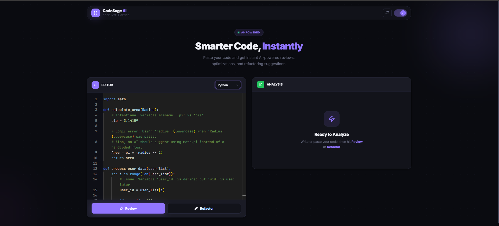
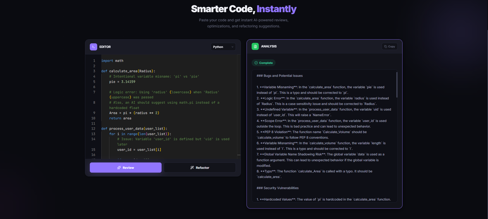
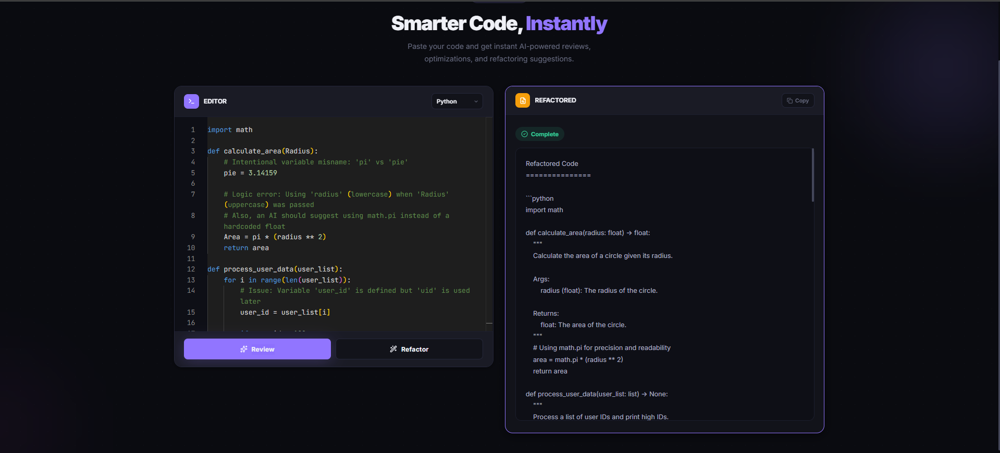

<div align="center">

# 🧠 CodeSageAI

**An AI-powered code review and refactoring tool built with FastAPI & React**

[](https://python.org)
[](https://fastapi.tiangolo.com)
[](https://react.dev)
[](https://vitejs.dev)
[](https://docker.com)
[](https://tailwindcss.com)

</div>

---

## 📸 Screenshots

### App Dashboard
<p align="center">
  
</p>

### Code Review Feature
<p align="center">
  
</p>

### Code Refactoring Feature
<p align="center">
  
</p>

---

## ✨ Features

- 🔍 **AI Code Review** — Get detailed code reviews with bug detection, security analysis, and best practices
- 🎨 **Code Refactoring** — Receive refactored code with improved readability and performance
- 💻 **Monaco Editor** — Professional code editor with syntax highlighting and auto-completion (same as VS Code)
- 🌈 **Beautiful UI** — Modern, premium design with Tailwind CSS and smooth animations
- ⚡ **Real-time Analysis** — Fast responses powered by Groq AI
- 🎯 **Multi-language Support** — JavaScript, Python, Java, TypeScript, C++, C#, Go, Rust, PHP, Ruby, Swift, Kotlin
- 📋 **Copy Results** — One-click copy functionality for AI-generated insights
- 🐳 **Dockerized** — One-command deployment with Docker Compose

---

## 🏗️ Project Structure

```
CodeSageAI/
├── Dockerfile              # 🐳 Unified multi-stage Dockerfile
├── docker-compose.yml      # 🐳 Docker Compose orchestration
├── supervisord.conf        # 🐳 Process manager config
├── .dockerignore           # 🐳 Docker build exclusions
├── README.md
│
├── server/                 # ⚙️ FastAPI Backend
│   ├── app/
│   │   ├── api/            # API routes
│   │   ├── models/         # Pydantic models
│   │   ├── services/       # Business logic (LLM integration)
│   │   ├── utils/          # Utilities
│   │   ├── config.py       # Configuration
│   │   └── main.py         # FastAPI app entry point
│   ├── .env                # Environment variables (not in git)
│   ├── .env.example        # Example env template
│   ├── Dockerfile          # Backend-only Dockerfile
│   └── requirements.txt    # Python dependencies
│
├── client/                 # 🎨 React Frontend
│   ├── src/
│   │   ├── components/     # React components
│   │   ├── services/       # API integration
│   │   ├── App.jsx         # Root component
│   │   └── index.css       # Global styles
│   ├── Dockerfile          # Frontend-only Dockerfile
│   ├── nginx.conf          # Nginx config for production
│   ├── package.json        # Node dependencies
│   └── vite.config.js      # Vite configuration
│
└── docs/
    └── images/             # 📸 Screenshots & documentation assets
```

---

## 🚀 Getting Started

### Prerequisites

- **Python 3.11+**
- **Node.js 20+**
- **Groq API Key** — Get it free from [console.groq.com/keys](https://console.groq.com/keys)

---

### 🐳 Option 1: Run with Docker (Recommended)

The fastest way to get up and running — **no need to install Python or Node.js!**

#### Quick Start

```bash
# 1. Clone the repository
git clone https://github.com/AyushPawshe08/CodeSageAI.git
cd CodeSageAI

# 2. Set up your API key
#    Edit server/.env and add your Groq API key
cp server/.env.example server/.env

# 3. Build and start everything
docker compose up --build
```

#### Pull from Docker Hub

```bash
# Pull the pre-built image
docker pull ayushp888/codesage-ai:latest

# Run it (make sure you have a server/.env file with your API key)
docker run -d -p 80:80 -p 8000:8000 --env-file ./server/.env ayushp888/codesage-ai:latest
```

#### Access the App

| Service        | URL                                                |
| -------------- | -------------------------------------------------- |
| 🌐 Frontend    | [http://localhost](http://localhost)                |
| ⚙️ Backend API | [http://localhost:8000](http://localhost:8000)      |
| 📖 API Docs    | [http://localhost:8000/docs](http://localhost:8000/docs) |

#### Useful Docker Commands

```bash
docker compose up --build     # Build & start
docker compose up -d          # Start in background
docker compose down           # Stop & remove containers
docker compose logs -f        # View live logs
docker compose restart        # Restart all services
```

---

### 💻 Option 2: Run Locally (For Development)

#### Backend Setup

```bash
# 1. Navigate to server directory
cd server

# 2. Create and activate virtual environment
python -m venv venv
venv\Scripts\activate          # Windows
# source venv/bin/activate     # Mac/Linux

# 3. Install dependencies
pip install -r requirements.txt

# 4. Configure environment variables
#    Edit .env file and add your Groq API key:
#    GROQ_API_KEY=your_actual_groq_api_key_here
#    MODEL_NAME=llama-3.3-70b-versatile

# 5. Start the server
python -m uvicorn app.main:app --reload
```

> Backend runs on: **http://127.0.0.1:8000** | API Docs: **http://127.0.0.1:8000/docs**

#### Frontend Setup

```bash
# 1. Navigate to client directory
cd client

# 2. Install dependencies
npm install

# 3. Start development server
npm run dev
```

> Frontend runs on: **http://localhost:5173**

---

## 🎯 Usage

1. **Start both servers** (backend + frontend) or run with Docker
2. **Open browser** to the frontend URL
3. **Paste your code** in the left panel
4. **Select programming language** from the dropdown
5. **Click "Review Code"** for code analysis or **"Refactor Code"** for improvements
6. **View results** in the right panel

---

## 🔧 API Endpoints

### `POST /api/review`

Review code for bugs, security issues, and best practices.

```json
// Request
{
  "code": "function example() { ... }",
  "language": "javascript"
}

// Response
{
  "result": "Detailed code review analysis..."
}
```

### `POST /api/refactor`

Get refactored code with improvements.

```json
// Request
{
  "code": "function example() { ... }",
  "language": "javascript"
}

// Response
{
  "result": "Refactored code with explanations..."
}
```

---

## 🎨 Tech Stack

| Layer      | Technology                           |
| ---------- | ------------------------------------ |
| **Backend**    | FastAPI, Uvicorn, Pydantic, Python-dotenv |
| **Frontend**   | React 19, Vite, Tailwind CSS, Monaco Editor, Lucide Icons |
| **AI Model**   | Groq AI (LLaMA 3.3 70B)             |
| **DevOps**     | Docker, Docker Compose, Nginx, Supervisor |

---

## 📝 Code Quality Features

The AI analyzes your code for:

| Category                | Description                          |
| ----------------------- | ------------------------------------ |
| 🐛 **Bugs**            | Potential issues and logic errors     |
| 🔒 **Security**        | Vulnerabilities and unsafe patterns   |
| ⚡ **Performance**      | Bottlenecks and optimization tips     |
| 📛 **Naming**          | Convention and readability checks     |
| 🛡️ **Error Handling**  | Missing or improper error handling    |
| 📚 **Documentation**   | Comments and documentation gaps       |
| ✅ **Best Practices**  | Design patterns and code standards    |

---

## 🚨 Troubleshooting

<details>
<summary><b>Backend Issues</b></summary>

**"uvicorn not recognized"**
```bash
python -m uvicorn app.main:app --reload
```

**"Module not found" errors**
```bash
pip install -r requirements.txt
```

**"API key not loading"**
- Make sure `.env` file exists in the `server/` directory
- Check that `GROQ_API_KEY` is set correctly
- Restart the server after changing `.env`

</details>

<details>
<summary><b>Frontend Issues</b></summary>

**"Cannot connect to server"**
- Ensure backend is running on http://127.0.0.1:8000
- Check CORS settings in `server/app/main.py`

**Build errors**
```bash
npm install --legacy-peer-deps
```

</details>

<details>
<summary><b>Docker Issues</b></summary>

**"Port already in use"**
```bash
# Find and stop whatever is using the port
docker compose down
```

**"Image not building"**
```bash
# Rebuild without cache
docker compose build --no-cache
```

**Container keeps restarting**
```bash
# Check the logs for errors
docker compose logs -f
```

</details>

---

## 📄 License

MIT License — feel free to use this project for learning and development!

## 🤝 Contributing

Contributions are welcome! Feel free to submit issues and pull requests.

---

<div align="center">

**Built with ❤️ using FastAPI, React, and Groq AI**

[⬆ Back to Top](#-codesageai)

</div>
